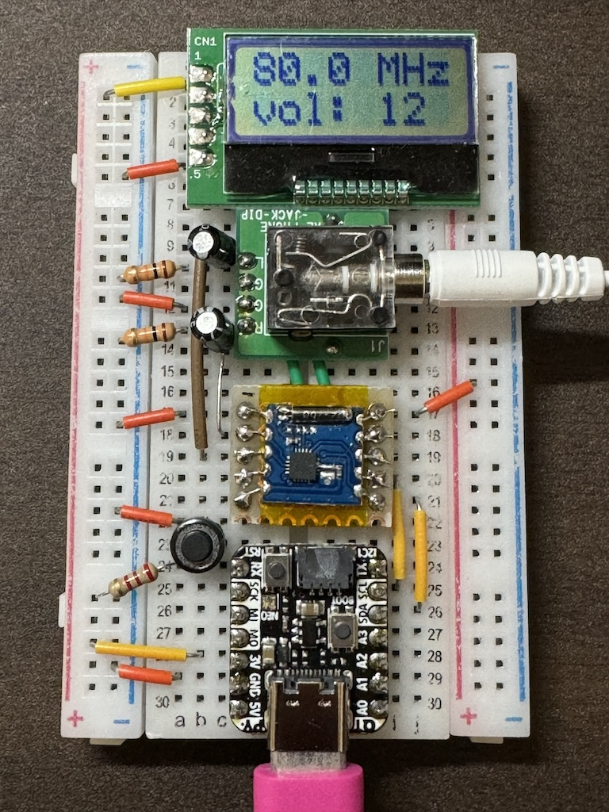

# fm-receiver-rda5807
FM radio receiver RDA5807H module




## How to build
```
$ git cloen https://github.com/toyowata/fm-receiver-rda5807
$ cd fm-receiver-rda5807
$ mbed deply
$ mbed compile -m raspberry_pi_pico -t gcc_arm
```

## How to flash the binary to target
* Enter the BOOTSEL mode
```
$ picotool load ./BUILD/RASPBERRY_PI_PICO/GCC_ARM/fm-receiver-rda5807.bin
```
* Press the RESET button

## References
* ArduinoとRDA5807でFMラジオを聴く
  https://qiita.com/nanase/items/b9efc547d395d2d7cbc0
* RDA5807MをArduinoで制御　DSP　ラジオモジュール　
  https://qiita.com/dabodabo/items/f8b52413849291a2d462

